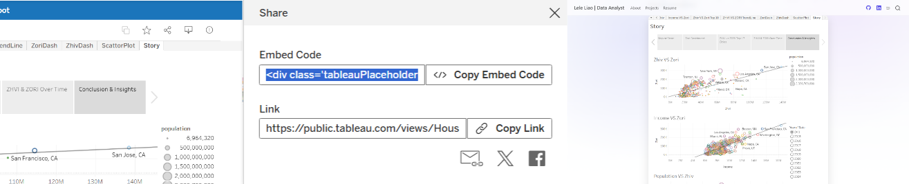
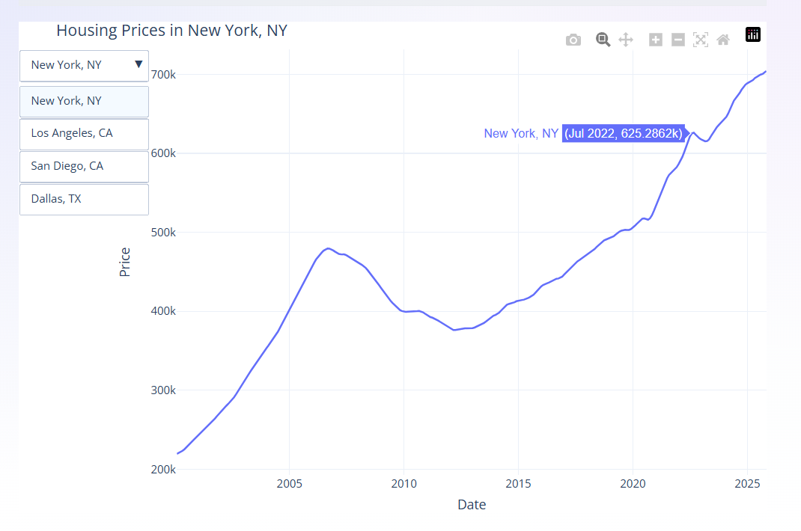

## Tableau Deployment

1. Publish to Tableau Public
2. Copy embed code
3. Paste into Quarto




# Plotly Deployment

::: columns

::: column
- Python-based
- Runs in browser
- No external hosting
:::

::: column

:::

:::

```python
# add line chart
fig.add_trace(go.Scatter(...))

# add dropdown
fig.update_layout(updatemenus=[...])
```


## Comparison

| Tableau | Plotly |
|--------|--------|
| Easy to use | Requires coding |
| External platform | No hosting needed |
| Less flexible | Highly customizable |

<br><br>

### Live Demo
https://rsm-l2liao.github.io/quarto_website/projects.html
